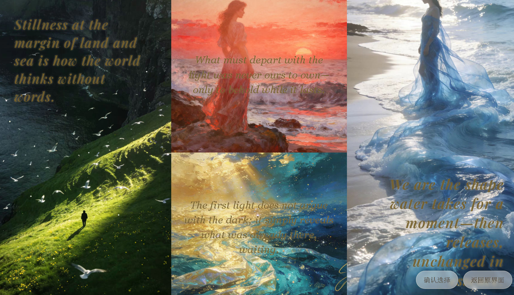

<div align="center">

# 可视化冒险类游戏 · 内容生产引擎


<p>
  
  
  
  
</p>

<h3>✨ 面向叙事类与可视化冒险游戏的自动化内容管线：世界观、分章剧情、角色设定与剧情插图，一体生成。</h3>

<p>
  💡 不是单次「问一句答一句」的聊天脚本，而是可落地的工程化链路——文本与视觉模型协同，服务你在本机跑通的 <code>game_server</code> 内容工作流。
</p>

<p>
  <b>🚀 本地立即体验：</b> <code>python game_server.py</code> → 浏览器打开 <code>http://127.0.0.1:5001</code>
</p>

<p>
  <a href="docs/ARCHITECTURE.md"></a>
  <a href="docs/AI_USAGE.md"></a>
  <a href="pyproject.toml"></a>
</p>

<p>
  <a href="#内容概览">内容概览</a> |
  <a href="#使用说明">使用说明</a> |
  <a href="#环境要求">环境要求</a> |
  <a href="#安装指南">安装指南</a> |
  <a href="#配置说明">配置说明</a> |
  <a href="#quick-start">快速开始</a>
</p>

</div>

---

> 🚀 **本地预览**  
> 启动 `game_server.py` 后，在浏览器打开 **`http://127.0.0.1:5001`** 进入主界面（地址须带 `http://`）。
>
> 如果你觉得本 README 的展示不够直观，可查看 `marketing-site` 目录中的前端 HTML，里面有更清晰的项目展示。

<h2 id="内容概览">内容概览（Overview）🌟</h2>

<p align="center">
  
</p>

本仓库的重心是 **叙事 / 可视化冒险类游戏用的内容生产引擎**：在同一套工程里，用 **大语言模型** 组织世界观与剧情文本，用 **图像与视觉模型** 生成、迭代剧情插图，把「写设定—拆章节—出立绘/场景」从手工拼 prompt 收束成 **可重复跑的管线**。

它不把游戏体验还原成「和聊天窗来回几句」——而是面向 **需要批量、结构化产出** 的语境：分章剧情、主角与配角设定、世界观一致性，以及与之配套的 **文生图 / 编辑** 链路，让你能在本机用 `game_server` 把内容推到可直接进工作流的状态。

若你正在搭互动叙事、AVG、跑团式文字冒险或原型 Demo，又希望 **文本与美术一起由模型驱动、由配置管控**，这条管线会更省迭代成本、也更适合和关卡 / 脚本编辑器对接。🎯

- 📖 **叙事资产**：世界观、分章剧情、角色与配角设定等结构化文本产出  
- 🎨 **配图管线**：文生图、参考视觉模型与可选编辑（img2img），与剧情任务对齐  
- 🧠 **多模型协同**：通用 LLM、群体智能（Council）与主持人模型等可组合调用（见配置说明）  
- ⚙️ **工程化落地**：Flask 本地服务、环境变量与依赖清单清晰，便于在团队里复现与扩展  

<table>
  <tr>
    <td width="33%" valign="top">
      <h3>📝 叙事与文本管线</h3>
      <p>把长篇设定与分章剧情从「临时对话」变成可维护的产出：适合需要连续篇章、角色弧光与世界观自洽的项目，而不是一次性生成后即弃的片段。</p>
    </td>
    <td width="33%" valign="top">
      <h3>🖼️ 多模态内容</h3>
      <p>剧情不仅停留在文字——插图生成与视觉参考在同一套配置下接入，让关键场景、角色立绘与氛围图能跟随剧情迭代，减少跨工具搬运。</p>
    </td>
    <td width="33%" valign="top">
      <h3>🔧 可配置栈</h3>
      <p>通过 <code>.env</code> 与多路 API 配置串联「哪家模型、哪条线路、何种超时」；需要时还可叠加 Wikipedia 检索等能力，按项目开关即可。</p>
    </td>
  </tr>
</table>

# 使用说明


本项目是一个为叙事类/文字冒险类游戏服务的「内容生产引擎」，用多种大模型（LLM + 视觉模型）自动生成世界观、剧情分章、主角设定以及对应的剧情插图。

目录

·环境要求

·安装指南

·配置说明

·快速开始

·贡献指南

·许可证


# 环境要求

Python 版本：Python 3.12 及以上（详见 pyproject.toml 依赖声明）。


# 安装指南

方式一：使用 uv 管理依赖（推荐）

使用前需自行安装 uv（不包含在 Python 里）：参见 https://docs.astral.sh/uv/getting-started/installation/


`pyproject.toml` 是本项目的 Python 工程清单文件，里面写了 Python 版本要求、`pip`/`uv` 要装哪些依赖包等内容；根目录下的这份文件已被 uv 和 pip 识别。


在项目根目录（与 `pyproject.toml` 同级）执行：


创建虚拟环境（可选，若已有环境可跳过）


```bash

uv venv .venv

```


Windows PowerShell 激活虚拟环境后，同步安装依赖：


```powershell

.\.venv\Scripts\activate

uv sync

```


方式二：使用 pip 安装依赖

若不使用 uv，可在项目根目录执行：


```powershell

python -m venv .venv

.\.venv\Scripts\activate

```


在项目根目录安装依赖：


```powershell

pip install .

```


若更习惯 `requirements.txt`，可改用：


```powershell

pip install -r requirements.txt

```


# 配置说明

项目通过 python-dotenv 加载环境变量，需在根目录创建 .env 文件并配置以下内容（可根据实际需求删减）。

1. 大语言模型配置

env

#通用大模型调用（用于文本分析、剧情生成等）

Camera_Analyst_API_KEY=your_api_key

Camera_Analyst_BASE_URL=https://api.yunwu.ai/v1

Camera_Analyst_MODEL=gpt-4o

Camera_Analyst_READ_TIMEOUT=180


2. 群体智能（Council）配置

env

#多模型列表（逗号分隔），默认使用 Camera_Analyst_MODEL

COUNCIL_MODELS=gpt-4o,gpt-4.1,gpt-4o-mini

#主持人模型，默认使用 Camera_Analyst_MODEL

CHAIRMAN_MODEL=gpt-4o


3. 图像生成配置

env

#图像生成服务提供商（默认：yunwu）

IMAGE_GENERATION_PROVIDER=yunwu

Image_Generation_API_KEY=your_image_api_key

Image_Generation_BASE_URL=https://yunwu.ai/v1

Image_Generation_MODEL=sora_image


#可选：其他图像服务配置

REPLICATE_API_TOKEN=


OPENAI_API_KEY=


STABLE_DIFFUSION_BASE_URL=


STABLE_DIFFUSION_API_KEY=


4. 图像编辑（img2img）配置

   

env


Img2img_API_KEY=your_img2img_api_key


Img2img_BASE_URL=https://yunwu.ai/v1


Img2img_PATH=/images/edit


Img2img_MODEL=stability-ai/stable-diffusion-img2img


6. 视觉模型配置


env


VISION_REF_MODEL=gpt-4o


VISION_REF_API_KEY=  # 不填则默认使用 OPENAI_API_KEY


VISION_REF_BASE_URL=  # 留空则使用 OpenAI 默认地址


VISION_REF_TIMEOUT=120


VISION_REF_MAX_IMAGE_SIDE=1024


VISION_REF_MAX_TOKENS=512


VISION_REF_USE_GEMINI_ENDPOINT=false


8. Wikipedia 检索配置


env


WIKI_LOOKUP_ENABLED=true


WIKI_LANGS=zh,en


WIKI_TIMEOUT_SECONDS=8


WIKI_MAX_SNIPPET_CHARS=1200


<a id="quick-start"></a>


# 快速开始


在终端中进入本仓库根目录（与 `pyproject.toml` 同级），激活虚拟环境：


```powershell

.\.venv\Scripts\activate
python game_server.py

```

在浏览器打开：`http://127.0.0.1:5001`（须带 `http://`）。
